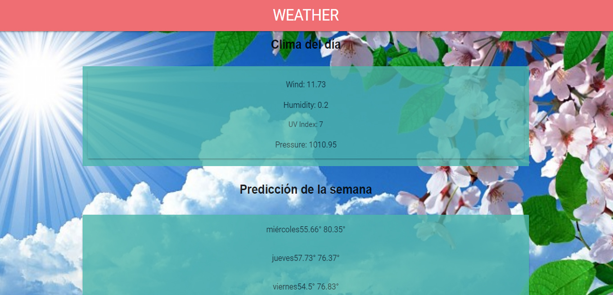

# Weather V 1.0 

## Desarrollado para 
[Laboratoria](http://laboratoria.la)

Por medio del consumos de la API de de Dark Sky se realizo una Web App meteorológica en al cual se puede consultar el clima del día y de los próximos 7 días.

TECNOLOGÍA UTILIZADA
*JS
*Framework Materialize
*Ajax
*Jquary
*API Dark Sky
*API Google Maps